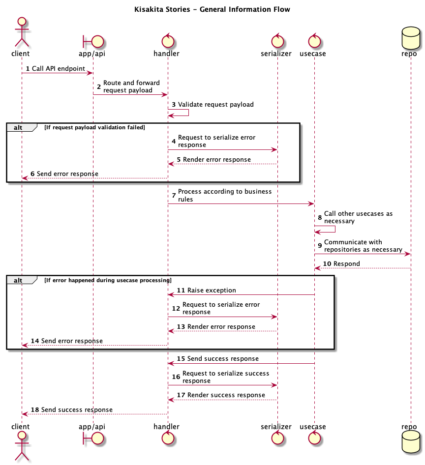

# kisakita

_"Ada sakit dalam Kisakita"_ (_"There was pain in our story"_)

Kisakita is an app for story writing collaboration. You write story together with your friends, or even total strangers, in a turn-based manner. This repository is a monolith backend written in Go, with these software engineering principles in mind:
* Domain-Driven Design (DDD)
* Test-Driven Development (TDD)
* Uncle Bob's Clean Code and Clean Architecture
* SOLID principles
* Gang of Four design patterns
* [JSON API](https://jsonapi.org/) schema

> "Kisakita" is a wordplay in Bahasa Indonesia, roughly translated to "our story".

## 1. General Information Flow



## 1. Setup

### 1.1 Prerequisites

* Go v14.1
* Ruby v2.7.1

### 1.2 Install External Dependencies

```bash
make dep
```

### 1.3 Running the Unit Tests

Run this command to execute all unit tests. Please ensure nothing is broken. Pull request with failing unit tests will not be accepted and merged to master.

```bash
make test
```

Run this command to check overall code coverage percentage.

```bash
make cov
```

Run this command to check covered vs. uncovered code lines. Red lines meant not covered, green ones are okay.

```bash
make covline
```

Please cover 100% of your code. Pull request that decreases master branch code coverage will not be accepted and merged to master.

### 1.4 Deploy Database

Run this command to setup database. Make sure to run it only once for first time.

```bash
make dbcreate
```

Run this command to check database migration status before executing the migration script.

```bash
make dbstatus
```

Run this command to migrate database to the latest migration script.

```bash
make dbmigrate
```

Follow these steps to create new migration file:
- Run this command: `rake db:new_migration name=create_stories`
- Edit the file: `vim db/migrate/20190922192846_create_stories.rb`
- Follow the guideline: https://guides.rubyonrails.org/active_record_migrations.html

### 1.5 Running the Program

Run this command during development to quickly build and run the program. This is meant only for quick and simple testing.

```bash
make run
```

For production environment, run this command to compile the program into executable for Unix-based system. The compiled binary will be put in `bin/kisakita_stories_api`.

```bash
make build
```

Run this command to remove the compiled build.

```bash
make clean
```

## 2. Contributing

### 2.1 Using Mockery

```bash
cd writing

# => Generating mock for: StoryUsecase in file: mocks/StoryUsecase.go
mockery -name=StoryUsecase

# => Generating mock for: StoryRepo in file: mocks/StoryRepo.go
mockery -name=StoryRepo
```

## 3. Attribution

- Project icon is made by <a href="https://www.flaticon.com/free-icon/dragon_1775587" title="Skyclick">Skyclick</a> from <a href="https://www.flaticon.com/" title="Flaticon">www.flaticon.com</a>.
